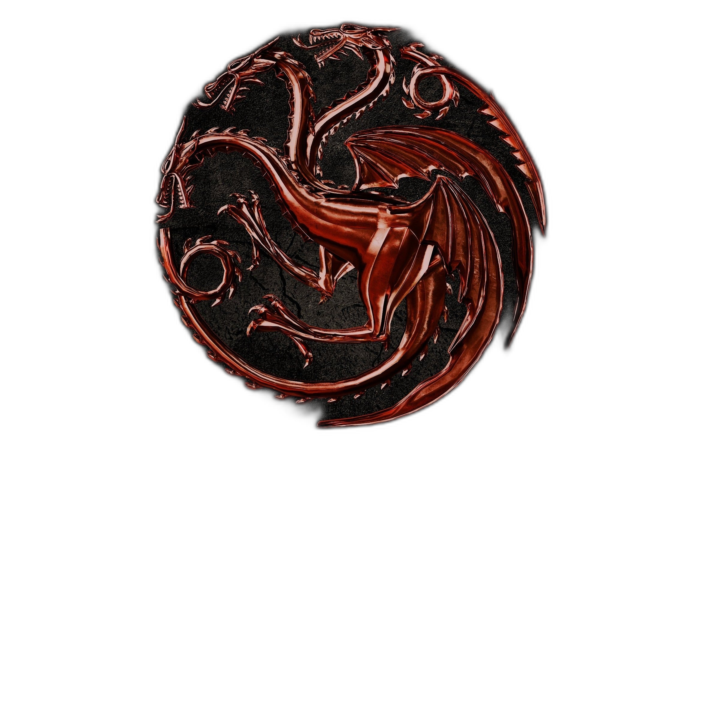

# Removendo fundo de imagens com Python

### Instale o rembg
https://pypi.org/project/rembg/

```
pip install rembg
```

```

from rembg import remove
# fornece ao interpretador python recursos de edição de imagem
from PIL import Image

```


